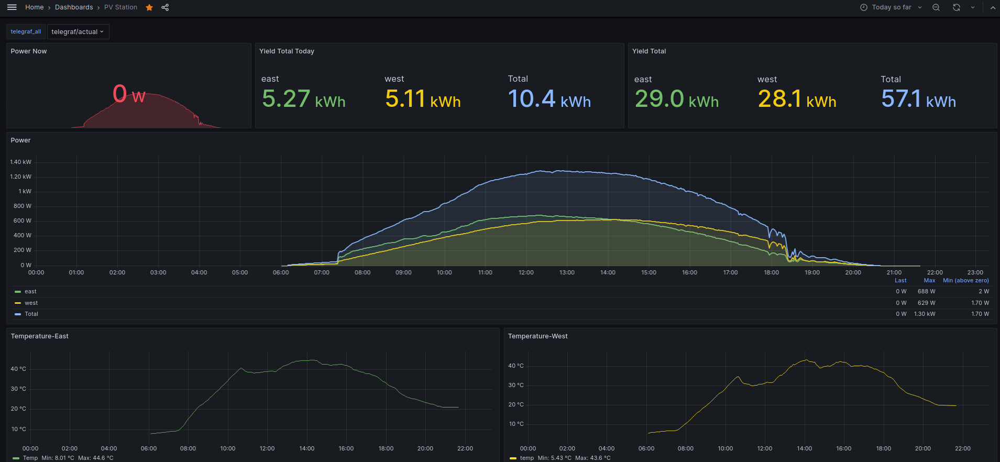
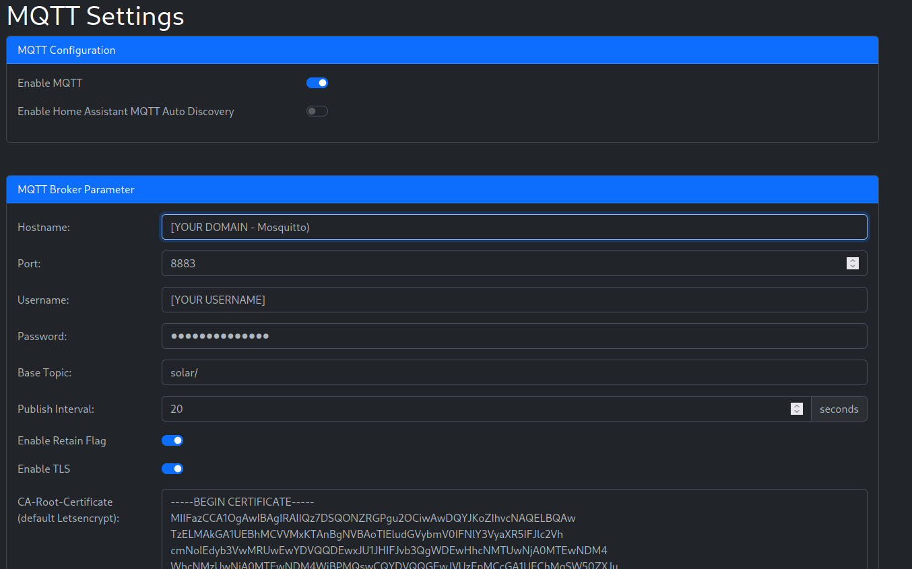

# Guide OpenDTU - mqtt - grafana


This is a guide how to setup [openDTU](https://github.com/tbnobody/OpenDTU) to publish data over mqtt to a server (`influxdb2`) with TLS encryption and visualize the data with `grafana`. The stored data gets downsampled to preserve memory on the server.



Content:
- [Guide OpenDTU - mqtt - grafana](#guide-opendtu---mqtt---grafana)
  - [Architecture](#architecture)
  - [Prerequisite](#prerequisite)
  - [MQTT - Mosquitto](#mqtt---mosquitto)
  - [Influx DB2 Setup](#influx-db2-setup)
  - [Telegraf setup](#telegraf-setup)
  - [Grafana](#grafana)
  - [Influx Data Optimization - (Optional)](#influx-data-optimization---optional)
    - [Telegraf - Buckets for downsampled data](#telegraf---buckets-for-downsampled-data)
    - [Downsampling Tasks](#downsampling-tasks)
    - [Create a query variable to select correct bucket depending on range selection grafana](#create-a-query-variable-to-select-correct-bucket-depending-on-range-selection-grafana)


## Architecture

Dataflow: 

```
Inverter -> openDTU -> MQTT Broker ->
   -> Telgraf (mqtt in/influx out) -> Influx DB -> Grafana
```

## Prerequisite 

* A linux (debian some stuff is debian specific) server (or cluster) with `grafana`, `influxdb2`,`mosquitto`, `telegraf`, `certbot`
* A openDTU Device (see https://github.com/tbnobody/OpenDTU) how to build one
* **There is also a `dockerized version`: https://github.com/Kraego/OpenDTU-Grafana-Stack (works basically but also needs some manual steps)** 


## MQTT - Mosquitto

* Mosquitto is mqtt broker (which handles the pub/sub communication via topics)
* Install with: `sudo apt install mosquitto mosquitto-clients`
* Create certificates for your server with `certbot`
* Since `certbot` will store the certificates with wrong permissions for this reason create a renewal-hook script (original see: https://github.com/eclipse/mosquitto/blob/master/README-letsencrypt.md)
* replace `MY_DOMAIN` with the domain from your `let's encrypt` certificate and store the content under `/etc/letsencrypt/renewal-hooks/deploy` and make it executable.
  ```
  touch /etc/letsencrypt/renewal-hooks/deploy/mosquitto-copy.sh
  nano /etc/letsencrypt/renewal-hooks/deploy/mosquitto-copy.sh
  # Copy Content below
  chmod +x /etc/letsencrypt/renewal-hooks/deploy/mosquitto-copy.sh
  ```

  **Content of /etc/letsencrypt/renewal-hooks/deploy/mosquitto-copy.sh**

  ```sh   
  # c#!/bin/sh

  # This is an example deploy renewal hook for certbot that copies newly updated certificates to the Mosquitto certificates directory and sets the ownership # and permissions so only the mosquitto user can access them, then signals
  # Mosquitto to reload certificates.

  # RENEWED_DOMAINS will match the domains being renewed for that certificate, so
  # may be just "example.com", or multiple domains "www.example.com example.com"
  # depending on your certificate.

  # Place this script in /etc/letsencrypt/renewal-hooks/deploy/ and make it
  # executable after editing it to your needs.

  # Set which domain this script will be run for
  MY_DOMAIN="[YOUR DOMAIN]"
  # Set the directory that the certificates will be copied to.
  CERTIFICATE_DIR=/etc/mosquitto/certs

  if [ "${RENEWED_DOMAINS}" = "${MY_DOMAIN}" ]; then
          # Copy new certificate to Mosquitto directory
          cp ${RENEWED_LINEAGE}/fullchain.pem ${CERTIFICATE_DIR}/server.pem
          cp ${RENEWED_LINEAGE}/privkey.pem ${CERTIFICATE_DIR}/server.key

          # Set ownership to Mosquitto
          chown mosquitto: ${CERTIFICATE_DIR}/server.pem ${CERTIFICATE_DIR}/server.key

          # Ensure permissions are restrictive
          chmod 0600 ${CERTIFICATE_DIR}/server.pem ${CERTIFICATE_DIR}/server.key

          # Tell Mosquitto to reload certificates and configuration
          pkill -HUP -x mosquitto
  fi
  ```
* Create a `mosquitto user` and password see: https://mosquitto.org/documentation/authentication-methods/ and correct the path in the setup below.
* `mosquitto Setup` (/etc/mosquitto/conf.d/default.conf):
  ```
  listener 1883 localhost
  password_file /etc/mosquitto/passwd

  listener 8883
  certfile /etc/mosquitto/certs/server.pem
  keyfile /etc/mosquitto/certs/server.key
  ```
* If not already done open the 8883 port on your server (`ìptables` or on ubuntu: `sudo ufw allow 8883`)
* Test the setup (best from client to server, or two terminals on the server)
  ```bash
  mosquitto_sub -h [YOUR DOMAINNAME] -t test -p 8883 --capath /etc/ssl/certs/ -u "[YOUR USERNAME]" -P "[YOUR_PASSWORD]"
  mosquitto_pub -h [YOUR DOMAINNAME] -t test -m "hello world" -p 8883 --capath /etc/ssl/certs/ -u "[YOUR USERNAME]" -P "[YOUR_PASSWORD]"
  ```
  * if everything works you should receive "hello world" on the subscriber side (mosquitto_sub).
* Setup mqtt on your `openDTU` (replace Hostname, Username and Password)
  
* Check on your server if you receive data from `openDTU`
  * Use wildcard `#` and verbose `-v` to print topic names 
  ```
  mosquitto_sub -h [YOUR DOMAIN_NAME] -t solar/# -p 8883 --capath /etc/ssl/certs/ -u "-u "[YOUR USERNAME]" -P "[YOUR_PASSWORD]" -v
  ```

## Influx DB2 Setup

Install (with apt `sudo apt install influxdb2`) - default settings port etc. (no username/pw).

* **Create a local influx user** (with `influx setup`)
* **Create a token for the Grafana** 
```
influx auth create --org "[YOUR ORGANIZATION]" --read-buckets
```
* For every authorized `influx` command use **-t [admin Token] to authorize**, you can lookup the tokens with `influx auth list`
* Hint how to check size of influx db on storage: 
```
sudo du -sh /var/lib/influxdb/engine/data/
```

## Telegraf setup

Telegraf acts as an adapter or bridge between mqtt subscriber and the influxdb2, it receives data over mqtt and stores it in the `telegraf/actual bucket` on influxdb2.

* install with: `sudo apt install telegraf`
* if not already done setup your influxdb2 with `influx setup`
* if you planning to do the data optimization part, create a bucket with retention 23h59m59s (1 sec less than day) on your influxdb2 instance:
  ```bash
  influx bucket create -o [YOUR ORGANIZATION] -n telegraf/actual -r 86399s --shard-group-duration 2h
  ```  
* otherwise create the bucket with the default retention time 168h (1 week)
  ```bash
  influx bucket create -o [YOUR ORGANIZATION] -n telegraf/actual
  ```  
* Create token for accessing influxdb2 and store it in a environment variable.
  ```bash
    # lookup and using a existing token
    influx auth list
    # create a new token
    influx auth create --org [YOUR ORGANIZATION] --read-orgs --write-orgs --write-buckets -t <adminToken>
    # store token in env variable
    export INFLUX_TOKEN="[YourAuthenticationToken]"
  ```
* In `/etc/telegraf/telegraf.conf` (replace username, password and organization)

  ```toml
  # Read metrics from MQTT topic(s)
  [[inputs.mqtt_consumer]]
    ## Broker URLs for the MQTT server or cluster.  To connect to multiple
    ## clusters or standalone servers, use a separate plugin instance.
    ##   example: servers = ["tcp://localhost:1883"]
    ##            servers = ["ssl://localhost:1883"]
    ##            servers = ["ws://localhost:1883"]
    servers = ["tcp://localhost:1883"]
    username = "[mosquitto username]"
    password = "[mosquitto password]"

    ## Topics that will be subscribed to.
    topics = [
      "solar/+/status/+",
      "solar/+/0/+",
      "solar/+/1/+",
      "solar/+/2/+"
    ]

  data_format = "value"
  data_type = "float"
  tagexclude = ["host","topic"]
  [[inputs.mqtt_consumer.topic_parsing]]
    topic = "solar/+/+/+"
    tags = "_/serial/channel/field"
    [[processors.pivot]]
      tag_key = "field"
      value_key = "value"

  # store it in influx
  [[outputs.influxdb_v2]]
    urls = ["http://localhost:8086"]
    token = "$INFLUX_TOKEN"
    organization = "[YOUR ORGANIZATION created in setup]"
    bucket = "telegraf/actual"
  ```
  * **Check telegraf setup:**
  ```
  sudo systemctl start telegraf
  telegraf --config /etc/telegraf/telegraf.conf --test  -test-wait 10 --config-directory /etc/telegraf/telegraf.d $TELEGRAF_OPTS
  ```
  * enable and start telegraf as service 
  ```
  sudo systemctl enable telegraf
  ```
  * **Check if telegraf is running:**
  `sudo systemctl status telegraf`
  or more detailed
  `sudo journalctl -f -u telegraf.service `


## Grafana 

* installed over apt: `sudo apt install grafana`
* Root the port (default: 3000) to the route used in your let's encrypt certificates
  * let's encrypt certificate for grafana
* add datasource telegraf (bucket) - use **FLUX** as it is the query language require since `influxdb2`
  
* Replace `[YOUR INVERTER SERIAL1]` and `[YOUR INVERTER SERIAL2]` with your inverter serial numbers in `PV Station-1684694694468.json`
* Replace the uid of the influxDB
  * Find out the uid of your influxDB with calling: `https://[your grafana URL]/api/datasources/name/InfluxDB` in your browser
  * Replace `uid` in every occurrence of: 
    ```
      "datasource": {
      "type": "influxdb",
      "uid": "ccdc09e4-b747-4e37-a3f9-aed28da7bab5"
    },
    ```
* **load the dashboard json `PV Station-1684694694468` in grafana**
* Change it to match your installation

## Influx Data Optimization - (Optional)

This section describes how to downsample old dataframes in your buckets. This helps to safe memory and will enable you to monitor data five years back.

### Telegraf - Buckets for downsampled data

* Create Buckets for downsampled data (this setup is for one year, if you want to keep the data longer adjust the `--retention` parameter)
  
  ```bash
  influx bucket create -o "[YOUR ORGANIZATION]" -n telegraf/day --retention 1d --shard-group-duration 1h
  influx bucket create -o "[YOUR ORGANIZATION]" -n telegraf/week --retention 7d --shard-group-duration 1d
  influx bucket create -o "[YOUR ORGANIZATION]" -n telegraf/month --retention 31d --shard-group-duration 1d
  influx bucket create -o "[YOUR ORGANIZATION]" -n telegraf/year --retention 1830d --shard-group-duration 7d
  ```

### Downsampling Tasks
* Configure **Downsampling Tasks** to compress data older than a week (from: https://cloud-infra.engineer/collectd-influxdb2-grafana-with-downsampling/) - replace [YOUR ORGANIZATION] with your organization.

  ```bash
  cat <<EOT > telegraf_downsample_day
  option task = {name: "telegraf_downsample_day", every: 1m}

  from(bucket: "telegraf/actual")
      |> range(start: -task.every)
      |> aggregateWindow(every: 1m, fn: mean)
      |> to(org: "[YOUR ORGANIZATION]", bucket: "telegraf/day")
  EOT

  influx task create -org "[YOUR ORGANIZATION]" -f telegraf_downsample_day

  cat <<EOT > telegraf_downsample_week
  option task = {name: "telegraf_downsample_week", every: 5m}

  from(bucket: "telegraf/actual")
      |> range(start: -task.every)
      |> aggregateWindow(every: 5m, fn: mean)
      |> to(org: "[YOUR ORGANIZATION]", bucket: "telegraf/week")
  EOT

  influx task create -org "[YOUR ORGANIZATION]" -f telegraf_downsample_week

  cat <<EOT > telegraf_downsample_month
  option task = {name: "telegraf_downsample_month", every: 30m}

  from(bucket: "telegraf/day")
      |> range(start: -task.every)
      |> aggregateWindow(every: 30m, fn: mean)
      |> to(org: "[YOUR ORGANIZATION]", bucket: "telegraf/month")
  EOT
  influx task create -org "[YOUR ORGANIZATION]" -f telegraf_downsample_month

  cat <<EOT > telegraf_downsample_year
  option task = {name: "telegraf_downsample_year", every: 6h}

  from(bucket: "telegraf/day")
      |> range(start: -task.every)
      |> aggregateWindow(every: 6h, fn: mean)
      |> to(org: "[YOUR ORGANIZATION]", bucket: "telegraf/year")
  EOT
  influx task create -org "[YOUR ORGANIZATION]" -f telegraf_downsample_year
  ```
  * Check if tasks are created with: `influx task list`

### Create a query variable to select correct bucket depending on range selection grafana

**This variable will be created during json import of the dashboard.**
But if you create a dashboard from scratch create this variable manually as described in the following section.

* See Variables in the settings of the dashboard
* This query finds the bucket with matching retention duration (if it don't work, check the retention settings of the buckets with `influx bucket list`)
* Variable: sort disable/on time change
* Query (source: http://wiki.webperfect.ch/index.php?title=Grafana:_Dynamic_Retentions_(InfluxDB))
  ```
  //Bucketfilter to filter only buckets beginning with name telegraf..
  bucketfilter = /telegraf.*/

  buckets()
    |> filter(fn: (r) => r.name =~ bucketfilter)
    //convert retentionperiod from nanosecond to days
    |> map(fn: (r) => ({r with 
      retentionPeriodinDays: r.retentionPeriod / 86400000000000}) 
    )
    //replace retentionpolicy infinity with a high number in NS
    |> map(fn: (r) => ({r with
      retentionPeriod: if r.retentionPeriod == 0 then 999999999999999999
      else r.retentionPeriod})
    )
    //calculate the duration from "to" and "from" timespan and convert it to nanosecond
    |> map(fn: (r) => ({r with 
      DashboardDurationinNS: (${__to} - ${__from}) * 1000000})
    )
    |> filter(fn: (r) => 
      r.DashboardDurationinNS <= r.retentionPeriod and
      r.retentionPeriod >= uint(v: now()) - uint(v: ${__from} * 1000000)
    )
    |> sort(columns: ["retentionPeriod"], desc: false)
    |> limit(n: 1)
    |> keep(columns: ["name"]) //remove all fields except for "name"
  ```

**Congratulations you now have a grafana for your opendtu**
